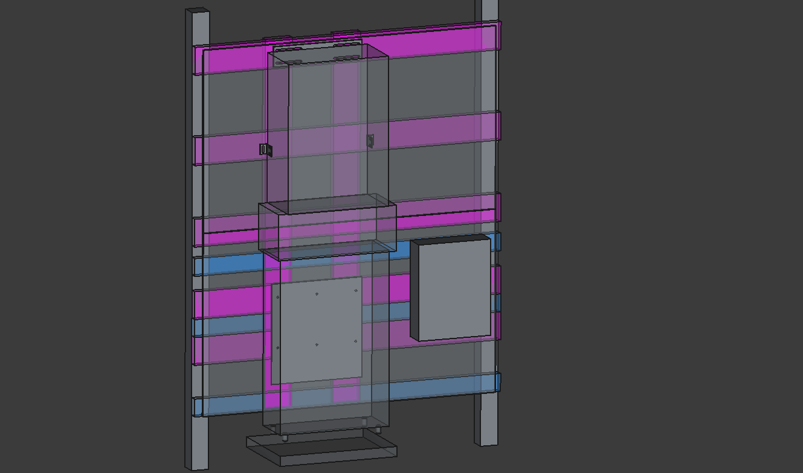

# About

This repo is to document the DIY residential solar project I took on in Q4 2025.
The project involves building a ground array of solar panels, building a frame for mounting power distribution parts, and installing a battery and inverter to send power to the grid.
The end result will be battery-backed power to a small residence, with excess solar power sent to the grid.

Since this is a grid-tied project, it must conform to all local/state codes and pass inspection, and all parts must be UL-listed.
It must also use equipment following standards required by my local power utility, which means more expensive equipment (as the standards are not implemented by all manufacturers).
The entire project is also located outdoors, requiring weatherproofing for all parts.
So this project is more complex and expensive than a comparable off-grid solution.

---

## Power Distribution

### Energy Storage System

The ESS is an [EG4 WallMount 280Ah All Weather Battery](https://eg4electronics.com/categories/batteries/eg4-wallmount-all-weather-battery) with 14.3 kWh of storage.
It's basically a very fancy all-weather 48V battery, with built-in heating.
It's very nicely integrated with the inverter (though I got it because it's 48V, so it's easier to replace than a higher-voltage system).
There's even a custom conduit box to stack them together.
But most importantly, it's UL-listed.

### Power Inverter

The inverter is an [EG4 12kPV](https://eg4electronics.com/categories/inverters/eg4-12kpv-all-in-one-hybrid-inverter/) with 12kW PV input and 8kW AC output.
It can power a 5-ton AC, and handles 4KW imbalance for up to 30 minutes.
It's a hybrid inverter, so it can send power to the grid.
It can take generator input, which is important if power goes out and the clouds are out for days.
It has two MPPTs, and can take microinverter AC power.
And most important (for grid-tying), it's UL1741-**SB** compliant.

### The Frame

A frame is constructed of pressure-treated wood.
Two 4x4x10 posts (ground contact-rated) are buried in the ground and set with concrete.
Between those posts are horizontal 2x6 and 2x4 boards attached with structural screws, and two 2x6 boards attached vertically to distribute load.
Sheets of concrete tile backer 1/2" thick are attached to the face of the wood with concrete backer screws (to create a fireproof barrier for the electrical equipment).

Below the frame, soil is compacted and leveled, with paver sand added and leveled to raise the ground level (for rain/snow/etc) approx. 6 inches.
A 2" thick 24x18 concrete paver is added on top for a stable fireproof base.

[FreeCAD 1.0.2 model of frame, inverter, conduit box, subpanel](./ESSandPVMount1.FCStd)

The 3D model linked above includes the real dimensions of the EG4 parts as I have measured them, including exact locations of bolt holes, mounting brackets, etc.
Please feel free to check their dimensions in FreeCAD for use in your own projects.
(But also, please confirm them before you commit to them; don't blame me if they don't fit!)

---

## Power Input

### Grid power input

The hybrid inverter can take power from the grid to charge the batteries, removing the necessity for a generator if it's cloudy for many days.

### Generator input

The hybrid inverter can also take power from a generator, if both solar and the grid are unavailable.

### Solar panels

The panels used are ten (10) [Phono Solar 440W PS440M8GFH-18/VNHB](https://www.phonosolar.com/static/upload/file/20240111/GL-EN-182-DRACO-N-108-16BB-silver.pdf).
They have a 15-year product and 30-year performance warranty, 22.53% module efficiency, an STC power rating of 440W, are bifacial, and I got them for $170/ea.
I also picked them up a few hours away, saving me a few hundred on shipping (plus I could reject them at the warehouse if damaged).
So a total of about 4.4 kW of PV output for $1700.

### Solar panel arrays

Upstate NY gets little light in winter, and being located deep in a valley, with trees everywhere, I had to be strategic about where the panels would be placed.
After plotting the direction of the sun from multiple locations, I ended up settling on two ground arrays, as I have a large side yard.

Each array will allow tilting the panels, so that in winter I can maximize production at a nearly 60-degree tilt.
During summer the tilt will change to around 35-degrees to maximize early fall production (my peak power usage).

The arrays are built on wooden pressure-treated frames.
Wood 4x4 posts are driven into the ground and concreted.
Then 2x6 boards are strung between the front posts and bolted in place.
From here a hinge is installed, and more boards are run towards the rear posts.
SuperStrut u-channel is then placed across those boards for the panels to attach to.
Tinned copper lay-in lugs are attached to each panel, with a ground wire running between all of them, and eventually back to the **Power Distribution** frame.
No grounding rod is installed, as there is already one at **Power Distribution**; from that, a bare copper ground cable is run to the arrays.

Each array is about 19.5 feet wide and 7 feet long. The rear array is set back about 15 feet and raised by 2 feet to compensate for shading.
(A single combined array would've required less area, but tilted at 60 degrees becomes quite tall and a building code headache)

#### Solar panel wiring/protection

Two strings of solar panels are run from the array through PVC conduit underground over to the **Power Distribution** frame.
Each string will go into a separate MPPT in the inverter, to prevent shading of one array from affecting the other.

An IMO DC Disconnect is installed at the **Power Distribution** frame to disconnect PV input from the inverter.

A Midnite Solar MNSPD-600 DC surge protector protects inputs from the PV lines from damaging the inverter.
